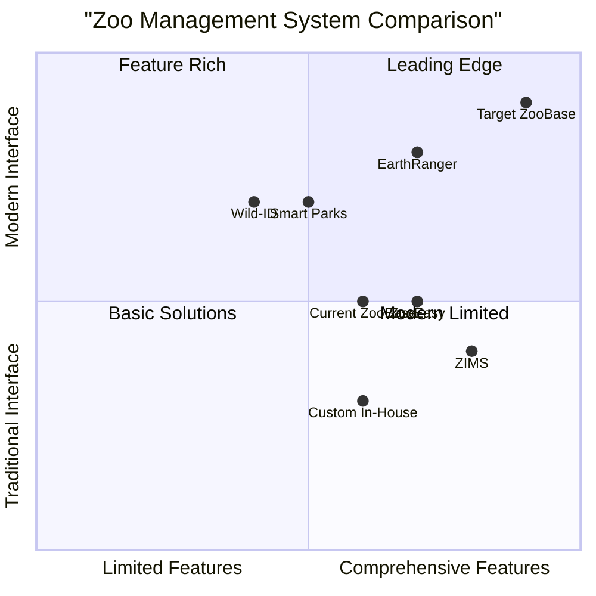
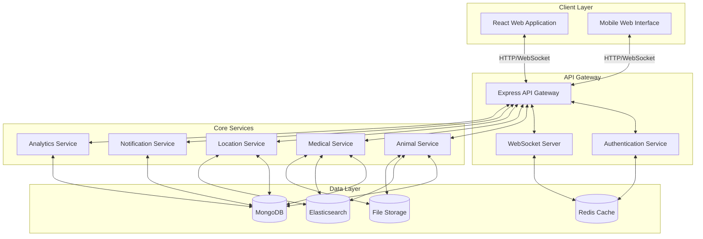
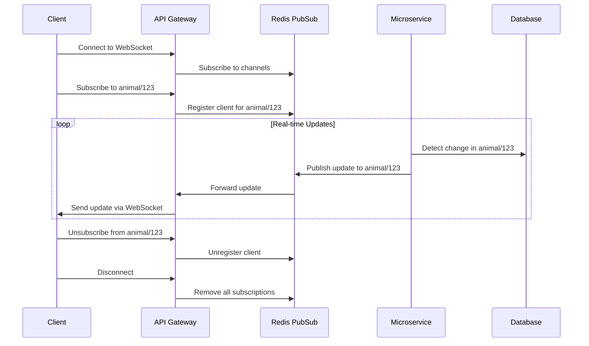

# ZooBase React & Node.js Redevelopment
Product Requirements Document (PRD)

Date: May 25, 2025  
Version: 1.0  
Prepared by: Emma, Product Manager

## Table of Contents

1. [Introduction](#1-introduction)
2. [Product Vision](#2-product-vision)
3. [Market Analysis](#3-market-analysis)
4. [User Stories](#4-user-stories)
5. [Real-Time Features Specification](#5-real-time-features-specification)
6. [Technical Specifications](#6-technical-specifications)
7. [User Interface Requirements](#7-user-interface-requirements)
8. [Implementation Phases](#8-implementation-phases)
9. [Success Metrics](#9-success-metrics)
10. [Appendices](#10-appendices)

## 1. Introduction

### 1.1 Purpose

This Product Requirements Document (PRD) outlines the specifications for redeveloping the ZooBase animal tracking system using Node.js and React. The redevelopment aims to create a modern, responsive web application with robust real-time data capabilities that enhance animal monitoring, staff collaboration, and operational efficiency.

### 1.2 Background

ZooBase is currently implemented as a comprehensive zoo management system with animal tracking capabilities. While the current implementation provides core functionality, there is a need to enhance the user experience with real-time data updates and a modern reactive interface. The redevelopment will leverage Node.js and React to achieve these goals while maintaining and extending the existing feature set.

### 1.3 Scope

The redevelopment will include:

- Complete rebuild of the frontend using React and modern UI frameworks
- Backend redevelopment using Node.js with Express
- Implementation of real-time data synchronization
- Enhanced data visualization and interactive user interfaces
- Mobile-responsive design
- Comprehensive API development for third-party integration
- Migration of existing data and functionality

### 1.4 References

- Existing ZooBase Product Requirements Document
- ZooBase System Design Document
- ZooBase Development Plan
- ZooBase Database Schema Analysis

## 2. Product Vision

### 2.1 Vision Statement

To create the most intuitive, responsive, and data-rich animal management platform that provides zoo staff with real-time insights and collaboration tools, ultimately improving animal welfare, operational efficiency, and conservation outcomes.

### 2.2 Goals

1. **Enhance Real-Time Monitoring**: Provide immediate updates on animal location, health status, and behavior for timely interventions and improved animal welfare.

2. **Improve User Experience**: Create an intuitive, responsive interface that works seamlessly across devices and reduces training time for staff.

3. **Enable Data-Driven Decisions**: Transform raw data into actionable insights through advanced analytics, visualizations, and predictive tools.

### 2.3 Non-Goals

- Development of native mobile applications (focusing on responsive web instead)
- Hardware integration with tracking devices (will be handled via APIs)
- Complete replacement of third-party veterinary or financial systems

## 3. Market Analysis

### 3.1 Competitive Analysis

#### Comparative Analysis

| System | Real-time Capabilities | Web Technology | Mobile Support | Interface Quality | API Extensibility |
|--------|------------------------|----------------|----------------|-------------------|------------------|
| **Current ZooBase** | Limited | Python/Django | Basic responsive | Functional | Basic REST API |
| **ZIMS** | Moderate | Legacy systems | Limited | Complex, dated | Limited |
| **ZooEasy** | Batch updates | PHP/JavaScript | Mobile version | Good | Basic integration |
| **Wild-ID** | Photo uploads only | Various | Field app | Specialized | Limited |
| **EarthRanger** | Strong real-time | Modern web stack | Good | Map-focused | Good |
| **Target ZooBase** | Comprehensive | React/Node.js | Fully responsive | Modern, intuitive | Comprehensive |

### 3.2 Market Trends

1. **Shift to Real-Time Data**: Increasing demand for immediate access to animal information and status updates.

2. **Mobile-First Operations**: Zoo staff increasingly rely on mobile devices for field data collection and monitoring.

3. **Collaborative Platforms**: Growing need for platforms that enable cross-functional team collaboration.

4. **Data Visualization**: Rising importance of intuitive data visualization for quick analysis and decision-making.

5. **Integration Ecosystems**: Increasing demand for systems that connect with specialized tools rather than all-in-one solutions.

6. **Remote Monitoring**: Accelerated adoption of remote monitoring capabilities for off-hours staff.

### 3.3 User Need Analysis

- **Immediate Feedback**: Users need to know when animals require attention without constant system checking.
- **Simplified Workflows**: Current systems often require multiple steps to complete common tasks.
- **Field Usability**: Staff need interfaces that work well in outdoor environments on various devices.
- **Collaborative Tools**: Teams need to share observations and coordinate care across shifts and departments.
- **Actionable Insights**: Raw data must be translated into clear recommendations and alerts.

## 4. User Stories

### 4.1 Animal Care Staff

- As a zookeeper, I want to receive real-time notifications on my mobile device when an animal's vitals change significantly, so I can respond quickly to potential health issues.
- As an animal care manager, I want to see a live dashboard of all animals' current status, so I can efficiently allocate staff resources.
- As a night keeper, I want the system to automatically alert me when nocturnal animals show unusual inactivity, so I don't have to constantly monitor each habitat.
- As a keeper, I want to quickly record observations via voice or text on my mobile device while in the field, so documentation is immediate and accurate.

### 4.2 Veterinary Staff

- As a veterinarian, I want real-time updates on treatment effectiveness based on animal behavior patterns, so I can adjust care plans promptly.
- As a vet technician, I want to receive immediate alerts when lab results are available, so I can take action without constantly checking the system.
- As a veterinary director, I want a live health status overview across all animals, so I can prioritize cases effectively.
- As a veterinarian, I want to collaborate in real-time with specialists at other institutions on complex cases, so we can leverage collective expertise.

### 4.3 Research and Management

- As a researcher, I want to observe behavior changes in response to habitat modifications in real-time, so I can make evidence-based recommendations.
- As a curator, I want automated alerts when environmental conditions in habitats drift from optimal ranges, so corrective action can be taken before animal welfare is affected.
- As a zoo director, I want real-time visitor engagement metrics correlated with animal activity, so I can optimize the visitor experience.
- As an operations manager, I want to see current staff locations relative to animal needs, so I can coordinate emergency responses efficiently.

## 5. Real-Time Features Specification

### 5.1 Core Real-Time Capabilities

#### 5.1.1 Real-Time Data Synchronization

- **WebSocket-Based Updates**: Establish persistent connections for immediate data transmission.
- **Selective Subscriptions**: Allow clients to subscribe only to relevant data streams.
- **Offline Reconciliation**: Synchronize data when connectivity is restored after offline periods.
- **Conflict Resolution**: Implement strategies for resolving conflicting updates from multiple sources.
- **Update Prioritization**: Prioritize critical updates (health alerts) over routine updates (location changes).

#### 5.1.2 Push Notification System

- **Multi-Channel Delivery**: Support web, mobile, email, and SMS notifications.
- **Customizable Alerts**: Allow users to configure notification preferences by type, animal, urgency, etc.
- **Smart Grouping**: Consolidate related notifications to prevent alert fatigue.
- **Acknowledgment Tracking**: Track which alerts have been seen and addressed.
- **Escalation Logic**: Automatically escalate unaddressed critical alerts to additional staff.

#### 5.1.3 Live Dashboards

- **Auto-Refreshing Displays**: Update dashboards without manual refresh.
- **Real-Time Metrics**: Show current status, counts, and key indicators.
- **Activity Feeds**: Display chronological streams of system events and staff actions.
- **Status Indicators**: Use clear visual indicators for normal, warning, and alert states.
- **Dynamic Filtering**: Allow real-time filtering and sorting of dashboard data.

### 5.2 Animal Monitoring Features

#### 5.2.1 Live Animal Status

- **Vital Signs Monitoring**: Real-time display of health metrics for sensor-equipped animals.
- **Behavior Tracking**: Immediate updates on activity types and durations.
- **Location Tracking**: Real-time positioning within habitats when tracking hardware is present.
- **Feeding Status**: Live updates on feeding schedules, consumption, and nutritional intake.
- **Social Interaction**: Real-time mapping of animal groupings and interactions.

#### 5.2.2 Anomaly Detection

- **Behavioral Anomalies**: Instant alerts when behavior deviates from established patterns.
- **Health Anomalies**: Real-time flagging of concerning vital sign changes.
- **Environmental Anomalies**: Immediate notification of habitat condition changes.
- **Pattern Analysis**: Continuous analysis of short and long-term trends with predictive alerts.
- **False Positive Reduction**: Smart filtering to minimize unnecessary alerts.

### 5.3 Collaboration Features

#### 5.3.1 Real-Time Communication

- **Contextual Chat**: In-app messaging tied to specific animals or situations.
- **Annotation Tools**: Ability to mark up images or data for discussion.
- **Video Conferencing**: Integrated video calls for remote consultation.
- **Shared Workspaces**: Collaborative note-taking and planning tools.
- **Presence Indicators**: Show which staff members are actively viewing an animal's data.

#### 5.3.2 Collaborative Decision Support

- **Shared Decision Logs**: Track team decisions and their outcomes in real time.
- **Treatment Coordination**: Coordinate and track complex treatment plans across teams.
- **Handoff Facilitation**: Structured tools for shift changes and responsibility transfers.
- **Expert Consultation**: Connect with specialists for real-time advice on complex cases.
- **Audit Trails**: Maintain comprehensive records of all actions and communications.

### 5.4 Operational Features

#### 5.4.1 Resource Management

- **Staff Location Tracking**: Optional real-time staff positioning for coordination.
- **Equipment Status**: Live updates on the availability and condition of equipment.
- **Inventory Levels**: Real-time tracking of supplies, medications, and food stocks.
- **Task Assignment**: Dynamic allocation and tracking of staff tasks.
- **Time-Critical Alerts**: Countdown timers for time-sensitive activities.

#### 5.4.2 Visitor Experience Integration

- **Live Activity Updates**: Inform visitors of current animal activities.
- **Feeding Time Alerts**: Push notifications for upcoming public feedings or demonstrations.
- **Educational Content**: Trigger contextual educational content based on animal activity.
- **Crowd Management**: Track visitor clustering and provide distribution suggestions.
- **Interactive Experiences**: Enable real-time visitor interaction with information displays.

## 6. Technical Specifications

### 6.1 Tech Stack

#### 6.1.1 Frontend

- **Framework**: React 18+ with Hooks and Context API
- **State Management**: Redux Toolkit for global state, React Query for server state
- **UI Components**: Tailwind CSS with custom component library
- **Real-Time Communication**: Socket.IO client
- **Data Visualization**: D3.js, Chart.js, and React Flow for network graphs
- **Forms**: React Hook Form with Yup validation
- **Maps/Location**: Mapbox GL JS or Leaflet
- **Accessibility**: WCAG 2.1 AA compliant components
- **Testing**: Jest, React Testing Library, and Cypress

#### 6.1.2 Backend

- **Runtime**: Node.js 18+ with Express.js framework
- **Real-Time**: Socket.IO server
- **API**: RESTful endpoints with OpenAPI specification
- **Authentication**: JWT-based auth with role-based permissions
- **Database**: MongoDB with Mongoose ODM
- **Caching**: Redis for performance optimization
- **Job Queue**: Bull for background processing
- **Search**: Elasticsearch for advanced search capabilities
- **File Storage**: AWS S3 or equivalent
- **Notifications**: Multi-channel notification service

#### 6.1.3 DevOps

- **Containerization**: Docker with Docker Compose for development
- **CI/CD**: GitHub Actions for automated testing and deployment
- **Monitoring**: Prometheus and Grafana for system metrics
- **Logging**: ELK stack (Elasticsearch, Logstash, Kibana)
- **Error Tracking**: Sentry for real-time error monitoring
- **Performance**: Lighthouse and Web Vitals for frontend performance
- **Security**: Regular dependency scanning and penetration testing

### 6.2 Architecture

#### 6.2.1 Overall Architecture

#### 6.2.2 Data Model

The system will utilize MongoDB collections with the following core schemas:

1. **Animals Collection**:
   - Basic information, identifiers, species data
   - Current status and location references
   - Lineage references (parents, offspring)
   - Custom fields for species-specific attributes

2. **Locations Collection**:
   - Enclosure information and environmental parameters
   - Occupancy tracking
   - Historical location data

3. **Medical Records Collection**:
   - Health events, examinations, and treatments
   - Vital signs and test results
   - Medication records
   - Attachments and media references

4. **Observations Collection**:
   - Timestamped behavioral observations
   - Feeding records
   - Activity patterns
   - Annotated media references

5. **Users Collection**:
   - Authentication information
   - Role and permission assignments
   - Notification preferences
   - Activity logs

### 6.3 Real-Time Implementation

#### 6.3.1 WebSocket Architecture

#### 6.3.2 Update Management

- **Throttling**: High-frequency updates will be throttled to prevent overwhelming clients
- **Batching**: Multiple small updates will be batched when appropriate
- **Prioritization**: Critical updates will bypass batching and throttling
- **Differential Sync**: Only changed data will be transmitted
- **Conflict Resolution**: Last-write-wins with version tracking

### 6.4 Security Requirements

1. **Authentication**:
   - JWT-based authentication with refresh tokens
   - MFA support for sensitive operations
   - SSO integration capability

2. **Authorization**:
   - Role-based access control (RBAC)
   - Attribute-based access control (ABAC) for fine-grained permissions
   - Temporal access restrictions where needed

3. **Data Security**:
   - Encryption at rest and in transit
   - PII protection and anonymization options
   - Audit logging of all data access

4. **API Security**:
   - Rate limiting and throttling
   - CORS protection
   - Input validation and sanitization
   - Protection against common attacks (XSS, CSRF, injection)

### 6.5 Performance Requirements

1. **Response Times**:
   - API responses < 200ms for 95% of requests
   - Real-time updates < 500ms from event to client display
   - Page loads < 2s for initial load, < 300ms for subsequent navigation

2. **Scalability**:
   - Support for 1000+ concurrent users
   - Handling of 10,000+ animals with complete histories
   - 100,000+ real-time events per hour

3. **Reliability**:
   - 99.9% uptime for core services
   - Graceful degradation during partial outages
   - Automated recovery from common failure modes

### 6.6 Accessibility and Compatibility

1. **Accessibility**:
   - WCAG 2.1 AA compliance
   - Screen reader compatibility
   - Keyboard navigation support
   - High contrast modes

2. **Browser Support**:
   - Chrome, Firefox, Safari, Edge (latest two major versions)
   - IE11 not supported

3. **Device Support**:
   - Desktop: 1024px+ viewport width
   - Tablet: 768px+ viewport width
   - Mobile: 320px+ viewport width
   - Touch interface optimization

## 7. User Interface Requirements

### 7.1 Design Principles

1. **Clarity**: Prioritize clear information hierarchy and readability
2. **Efficiency**: Minimize clicks for common tasks
3. **Consistency**: Maintain consistent patterns and components
4. **Feedback**: Provide immediate feedback for all user actions
5. **Forgiving**: Allow users to undo actions and correct mistakes
6. **Context-Aware**: Show relevant controls based on user context
7. **Responsive**: Adapt gracefully to different device sizes

### 7.2 Core UI Components

#### 7.2.1 Real-Time Dashboard

The dashboard will feature:
- Animal status overview with color-coded indicators
- Recent alerts section with priority levels
- Active staff display showing location and assignments
- Activity timeline showing real-time system events
- Filterable views by animal type, location, and status
- Interactive map view of animal locations

#### 7.2.2 Animal Profile View

The animal profile will include:
- Real-time status indicators and vital signs
- Current location with interactive map
- Daily activity chart updating in real time
- Quick action buttons for common tasks
- Live team updates and collaboration tools
- Tabbed interface for detailed information access

#### 7.2.3 Medical Records Interface

The medical records interface will provide:
- Real-time status updates for ongoing treatments
- Live collaboration tools for veterinary teams
- Chronological record display with filtering options
- Media attachment capability for images and documents
- Integration with lab result systems for immediate updates

### 7.3 Mobile Considerations

- **Progressive Disclosure**: Use collapsible sections to maintain clarity on small screens
- **Touch Targets**: Minimum 44x44px for all interactive elements
- **Offline Support**: Critical features must work offline with sync when connectivity returns
- **Battery Optimization**: Adjust polling frequency based on battery status
- **Reduced Data Mode**: Option to limit media quality when on cellular connections

### 7.4 Notification Design

- **Contextual Display**: Show notifications within the relevant context when possible
- **Urgency Levels**: Visual distinction between routine, important, and critical notifications
- **Actionable**: Include direct action buttons within notifications
- **Grouping**: Intelligently group related notifications to reduce overwhelm
- **Persistence**: Critical alerts remain visible until acknowledged

## 8. Implementation Phases

### 8.1 Phase 1: Foundation (3 months)

#### 8.1.1 Key Deliverables

- Core application architecture and infrastructure setup
- Authentication and user management system
- Basic animal profiles and record management
- Initial real-time notification framework
- Responsive UI foundation

#### 8.1.2 Technical Milestones

1. **Week 2**: Architecture design and database schema finalization
2. **Week 4**: Core API implementation with authentication
3. **Week 8**: Basic real-time synchronization working
4. **Week 10**: Animal profile management complete
5. **Week 12**: Initial deployment with foundational features

### 8.2 Phase 2: Core Real-Time Features (3 months)

#### 8.2.1 Key Deliverables

- Comprehensive real-time data synchronization
- Advanced notifications system with prioritization
- Interactive dashboards with live updates
- Medical records with real-time collaboration
- Mobile-optimized interfaces

#### 8.2.2 Technical Milestones

1. **Week 2**: WebSocket infrastructure enhancement complete
2. **Week 5**: Advanced notification system implementation
3. **Week 8**: Real-time dashboard with filtering
4. **Week 10**: Collaborative medical records system
5. **Week 12**: Full mobile responsiveness

### 8.3 Phase 3: Advanced Features & Integration (4 months)

#### 8.3.1 Key Deliverables

- Advanced analytics and visualization tools
- Predictive health monitoring algorithms
- External systems integration (veterinary, environmental)
- Advanced search and filtering capabilities
- Full offline support for mobile

#### 8.3.2 Technical Milestones

1. **Week 3**: Analytics framework implementation
2. **Week 6**: Integration with external systems
3. **Week 10**: Predictive monitoring algorithms
4. **Week 14**: Advanced search implementation
5. **Week 16**: Complete offline functionality

### 8.4 Phase 4: Optimization & Expansion (2 months)

#### 8.4.1 Key Deliverables

- Performance optimization across all features
- Enhanced data visualization tools
- Multi-institution data sharing capabilities
- Advanced reporting and export features
- API platform for third-party development

#### 8.4.2 Technical Milestones

1. **Week 2**: Performance optimization complete
2. **Week 4**: Advanced visualization tools
3. **Week 6**: Multi-institution framework
4. **Week 8**: Public API documentation and developer portal

## 9. Success Metrics

### 9.1 Technical Metrics

- **Real-time Performance**: Average update delay < 500ms from event to user display
- **System Reliability**: 99.9% uptime for core services
- **Mobile Usability**: 95% feature parity between desktop and mobile interfaces
- **Offline Functionality**: Core features functional during 30+ minutes of disconnection
- **API Performance**: 95% of API requests completing within 200ms

### 9.2 User Adoption Metrics

- **Daily Active Users**: 90% of staff using the system daily within 2 months of launch
- **Mobile Usage**: 70% of field staff using mobile interface regularly
- **Feature Utilization**: 80% of new real-time features used regularly after 3 months
- **Training Efficiency**: 50% reduction in training time compared to previous system
- **User Satisfaction**: 85%+ positive feedback on real-time capabilities

### 9.3 Business Impact Metrics

- **Time Savings**: 30% reduction in time spent on routine monitoring tasks
- **Response Time**: 40% improvement in response time to animal health incidents
- **Data Quality**: 50% increase in observation recording frequency
- **Collaboration**: 35% increase in cross-department collaboration instances
- **Knowledge Sharing**: 45% increase in documented insights from animal observations

## 10. Appendices

### 10.1 Glossary

- **Real-time Data**: Information that is delivered immediately after collection without delay
- **WebSocket**: Communication protocol providing full-duplex communication channels over TCP
- **RBAC**: Role-Based Access Control, a method of regulating access based on roles
- **JWT**: JSON Web Token, a compact, URL-safe means of representing claims
- **Redux**: State container for JavaScript applications
- **React Hook**: Functions that let you use state and other React features without writing a class

### 10.2 Reference Materials

- ZooBase Original PRD: `/data/chats/in98f/workspace/zoobase_prd.md`
- ZooBase System Design: `/data/chats/in98f/workspace/zoobase_system_design.md`
- ZooBase Development Plan: `/data/chats/in98f/workspace/zoobase_development_plan.md`
- React Official Documentation: https://reactjs.org/docs/getting-started.html
- Node.js Documentation: https://nodejs.org/en/docs/
- Socket.IO Documentation: https://socket.io/docs/v4/

### 10.3 Open Questions

1. **Data Migration Strategy**: What is the preferred approach for migrating existing animal data to the new system?
2. **Hardware Integration**: What specific tracking devices and sensors need integration with the real-time system?
3. **Compliance Requirements**: Are there specific regulatory requirements for animal data that must be addressed?
4. **Offline Depth**: How extensive should offline capabilities be (basic data entry vs. full functionality)?
5. **Multi-institution Requirements**: What level of data sharing between cooperating institutions is needed?